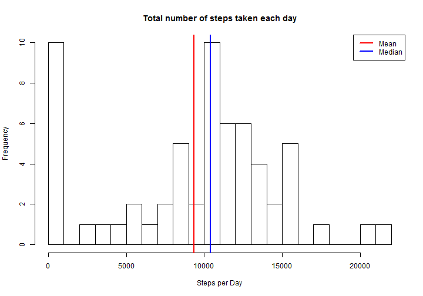
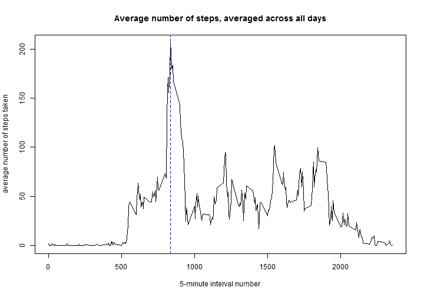
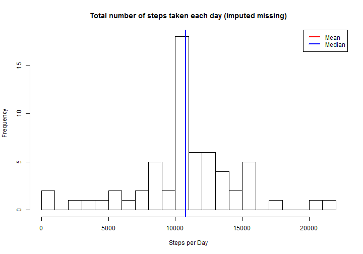
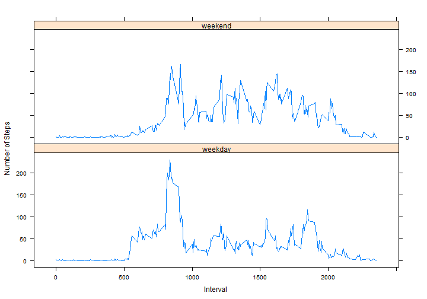

# Reproducible Research: Peer Assessment 1


## Loading and preprocessing the data

```r
# install packages
suppressPackageStartupMessages(require(plyr))
suppressPackageStartupMessages(require(lattice))

# read dataset
dat = read.csv(unz("activity.zip", "activity.csv"))

# add weekend factor variable
dat = mutate(dat, weekday = weekdays(as.Date(date), abbreviate = T))
dat = mutate(dat, weekday = (weekday %in% c("Sat", "Sun")))
dat = mutate(dat, weekday = factor(weekday, labels = c("weekday", "weekend")))
```


We impute missing values by calculating the average number of steps taken in each interval across all dates.

```r
# define imputation function
impute.mean <- function(x) replace(x, is.na(x), mean(x, na.rm = TRUE))
# apply imputation function across intervals
dat = ddply(dat, ~interval, transform, impSteps = impute.mean(steps))
head(dat)
```

```
##   steps       date interval weekday impSteps
## 1    NA 2012-10-01        0 weekday    1.717
## 2     0 2012-10-02        0 weekday    0.000
## 3     0 2012-10-03        0 weekday    0.000
## 4    47 2012-10-04        0 weekday   47.000
## 5     0 2012-10-05        0 weekday    0.000
## 6     0 2012-10-06        0 weekend    0.000
```


Aggregate Number of Steps across days, intervals, weekdays

```r
# Sum Number of Steps by date
dat.daily = ddply(dat, .(date), summarize, steps = sum(steps, na.rm = T), impSteps = sum(impSteps))
head(dat.daily)
```

```
##         date steps impSteps
## 1 2012-10-01     0    10766
## 2 2012-10-02   126      126
## 3 2012-10-03 11352    11352
## 4 2012-10-04 12116    12116
## 5 2012-10-05 13294    13294
## 6 2012-10-06 15420    15420
```

```r

# Average Number of Steps by Interval
dat.int = ddply(dat, .(interval), summarize, avgSteps = mean(steps, na.rm = T))
head(dat.int)
```

```
##   interval avgSteps
## 1        0  1.71698
## 2        5  0.33962
## 3       10  0.13208
## 4       15  0.15094
## 5       20  0.07547
## 6       25  2.09434
```

```r

# Average Number of Steps by Interval and Weekend
dat.int.wk = ddply(dat, .(interval, weekday), summarize, impSteps = mean(impSteps))
head(dat.int.wk)
```

```
##   interval weekday impSteps
## 1        0 weekday  2.25115
## 2        0 weekend  0.21462
## 3        5 weekday  0.44528
## 4        5 weekend  0.04245
## 5       10 weekday  0.17317
## 6       10 weekend  0.01651
```


## What is mean total number of steps taken per day?


```r
# Calculate mean and median steps averaged across all days
stepsMean = mean(dat.daily$steps)
stepsMedian = median(dat.daily$steps)

# plot histogram of average steps per interval
hist(dat.daily$steps, breaks = 20, main = "Total number of steps taken each day", 
    xlab = "Steps per Day")
abline(v = stepsMean, col = "red", lwd = 2)
abline(v = stepsMedian, col = "blue", lwd = 2)
legend("topright", c("Mean", "Median"), lty = c(1, 1), lwd = c(2, 2), col = c("red", 
    "blue"))
```

 


The mean total number of steps taken per day is 9,354.23 and the median is 10,395.

## What is the average daily activity pattern?

```r
# Calculate the maximum average steps and the interval at which it occurs
stepsMax = max(dat.int$avgSteps)
stepsMaxInt = dat.int$interval[which(dat.int$avgSteps == stepsMax)]

# Plot time series of daily steps pattern
plot(dat.int$interval, dat.int$avgSteps, type = "l", main = "Average number of steps, averaged across all days", 
    xlab = "5-minute interval number", ylab = "average number of steps taken")
abline(v = stepsMaxInt, lty = 2, col = "blue")
```

 


The maximum average number of steps is 206.2, which occurs in interval number 835


## Imputing missing values

```r
# Number of rows with missing data
colSums(is.na(dat))
```

```
##    steps     date interval  weekday impSteps 
##     2304        0        0        0        0
```

```r

# Mean and Median steps after imputation
stepsMeanImp = mean(dat.daily$impSteps)
stepsMedianImp = median(dat.daily$impSteps)

# Histogram of imputed values
hist(dat.daily$impSteps, breaks = 20, main = "Total number of steps taken each day (imputed missing)", 
    xlab = "Steps per Day")
abline(v = stepsMeanImp, col = "red", lwd = 2)
abline(v = stepsMedianImp, col = "blue", lwd = 2)
legend("topright", c("Mean", "Median"), lty = c(1, 1), lwd = c(2, 2), col = c("red", 
    "blue"))
```

 

```r

```


There are 2304 missing values in the data set. As demonstrated in "Loading and Preprocessing" section above, we imputed missing values by calculating the average number of steps taken in each interval across all dates.

After imputing the missing data, the mean total number of steps taken per day is 10,766.19 and the median is 10,766.19.

As a result of imputing missing values, both the average and the median number of steps increase. More importantly, the distribution of steps is no longer skewed by the missing values. Instead, the mean and the median are the same, suggesting a symmetrical distribution.

## Are there differences in activity patterns between weekdays and weekends?

```r

# Plot time series of daily steps pattern by weekday/weekend
xyplot(impSteps ~ interval | weekday, data = dat.int.wk, type = "l", layout = c(1, 
    2), ylab = "Number of Steps", xlab = "Interval")
```

 


From visual inspection, it appears that compared to weekdays, weekends have a different and distinct intra-day pattern. The period of activity begins earlier in the day (morning) during the weekdays, followed by a decreased activity during mid-day. On the other hand, the level of activity on the weekends appears to remain relatively constant throughout the day.  
